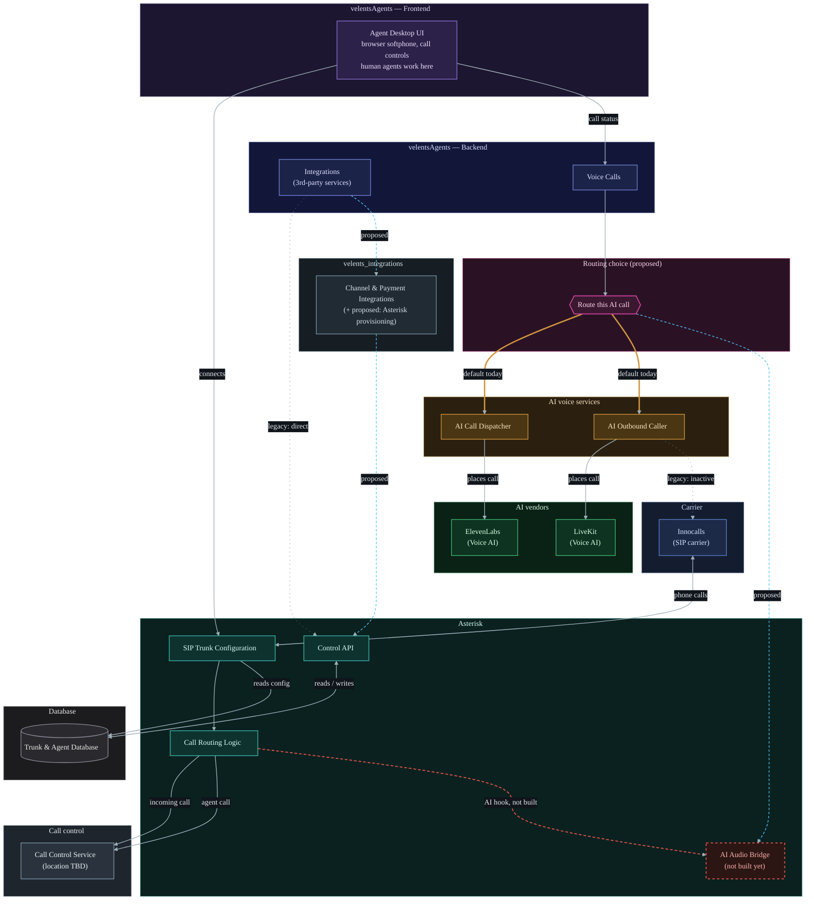

# Asterisk service — deployment test suite + platform feature gap analysis

## Context

Earlier this session we manually diagnosed a real production misconfiguration: `.env` had
`ASTERISK_WSS_URL=wss://asterisk.velents.ai:8089/ws`, but port 8089 is completely unreachable
externally — `kubectl get svc/ingress -n velents` showed the real routing is the `asterisk-wss`
Service (port 80 → targetPort 8088) fronted by an nginx Ingress on host `asterisk.velents.ai`
(80/443), i.e. TLS terminates at the ingress and forwards plaintext WS to the pod's 8088. Nothing
routes to 8089 externally. The working URL is `wss://asterisk.velents.ai/ws` (default 443),
confirmed via a 426 Upgrade Required response carrying `Server: Asterisk/GIT-master-`. The user
fixed `.env` and asked for a repeatable test suite so this class of bug — config says one thing,
actual K8s routing does another — gets caught automatically going forward.

Before designing anything new, I checked what already exists (`scripts/audit-call-pipeline.sh`,
`deploy/README.md`, `deploy/SIP_GO_LIVE_RUNBOOK.md`), actually ran the existing script read-only
against the live cluster, and read the `ref/` directory (platform architecture + product-roadmap
docs) to ground the plan in the real, current state of both the deployment and the broader
product. That work surfaced three confirmed bugs in the existing test script and a full picture of
what's built vs. planned across the platform, both captured below.

---

## TODO

**Scope for this pass: only what's actionable inside the `asterisk` repo.** Everything that needs
another repo cloned, another team/person, or multi-week feature work is listed under "Deferred" for
visibility, but is explicitly **not** being executed now.

### This session — in this repo

- [x] **Bug 1** — `.env` `ASTERISK_WSS_URL` pointed at dead port `:8089` — already fixed by the user
      this session.
- [x] **Bug 2** — Fixed Gate A/B WSS-host detection in `scripts/audit-call-pipeline.sh` (derives
      `WSS_HOST` once from `.env`'s `ASTERISK_WSS_URL`/`ASTERISK_SIP_DOMAIN`, exact-matches against
      live Ingress hosts). Verified live: now correctly detects `asterisk.velents.ai` and Gate B's
      TLS-cert check actually runs (PASS, Let's Encrypt).
- [x] **Bug 3** — Fixed Gate A's RTP-range check (now counts individual NodePort UDP entries
      instead of matching a literal range string). Verified live: WARNs (not FAILs) on the known
      4-port limit, citing `SIP_GO_LIVE_RUNBOOK.md` item 1.
- [x] **Bug 4** — Fixed Gate D's transport-loaded grep anchor (`'^ Transport:'` → `'^Transport:'`).
      Verified live: `transport-udp`/`transport-tcp`/`transport-wss` now correctly PASS, only
      `transport-tls` WARNs (expected/optional).
- [x] **Bug 5** — Patched `deploy/control_api.py`'s `/healthz` to actually check ARI reachability
      (new `_check_ari_reachable()`, basic-auth GET to `127.0.0.1:8088/ari/asterisk/info`, mirrors
      `deploy/README.md`'s documented readiness probe) — returns 503 with `ari_reachable: false`
      when ARI is down instead of always reporting 200. Smoke-tested locally (no-creds and
      unreachable-ARI cases both fail cleanly, no crash). **Not yet deployed** — the live pod runs
      the prior image; shipping this needs a rebuild/rollout, out of scope for this pass.

### Deferred — needs another repo, another person, or multi-week work

- [ ] **Bug 6** — Confirm with whoever owns the consumer of `ARI_URL` whether
      `http://120.0.0.1:8088` is a typo for `127.0.0.1` (not consumed in this repo — needs a human
      outside it to confirm intent).
- [ ] **Resolve the ARI/Stasis "call-engine" location** — not found in any repo checked out on this
      machine; Asterisk's own docs point to an uncloned `agent-hub` GitHub repo, which contradicts
      an earlier note claiming "agent-hub = velentsAgents." Needs `Velents-Technologies-UG/agent-hub`
      actually cloned to resolve.
- [ ] Build the canonical session/event model (AGH-6670) — blocked on the item above.
- [ ] Wire the AI audio **bridge** (AGH-6681) — spans this repo (AudioSocket tap) *and*
      `livekit-outbound-caller` (activating its commented-out trunk-selection branch) — a
      cross-repo change, not something this repo alone can complete. **Innocalls stays the
      default** for AI-initiated calls either way — this bridge only fires when an explicit
      flag/toggle selects the Asterisk route; it does not change default behavior.
- [ ] Build the screen-pop / customer-context handoff (AGH-6695) — needs a realtime-gateway service
      that doesn't exist yet, outside this repo.
- [ ] Establish DR posture for the voice spine (AGH-7262) — infra-level, not a code change here.

---

## `ref/` directory — what exists vs. what's still missing

Four docs live in `ref/`: `velents-platform-services-overview.md` (written by directly reading the
actual repos under `E:\Projects\Velents\` — the most reliable source here),
`agent-hub-cxm-contact-center-full-context-dossier.md` (1255 lines — the full Linear-derived
product roadmap: 100 issues, P0–P5 phases, 13 parent increments with AGH-#### IDs),
`infath-cxm-platform-demo-analysis.md` (a reverse-engineered analysis of a click-through,
no-backend UI demo), and `infath-service-scope-softphone-and-tech-alternatives.md` (an older
architecture-alternatives doc). Plus a handful of SVG diagrams (not re-parsed here — the text docs
already describe what they show).

**Two corrections the docs make about themselves, worth carrying forward:**
- The tech-alternatives doc frames **FreeSWITCH as primary, Asterisk as the alternative** for the
  media/call-control tier — the services-overview doc explicitly flags this as **stale**: *"the
  actual codebase has committed to Asterisk, with real infrastructure built on it... Don't silently
  follow the old planning docs' FreeSWITCH-primary framing."*
- "agent-hub" (the name used throughout the dossier/Linear project) is **not** a separate Next.js
  repo — it **is** `velentsAgents`, a Laravel 12 / PHP full-stack app. A prior version of the
  services-overview doc assumed otherwise; corrected 2026-07-15.

**Dossier-wide status baseline**: of the 100 tracked issues, only **AGH-6655** (Inc 1, the P0 voice
spine) is "In Progress." **98 are Backlog. 1 (AGH-6701) is Canceled** (superseded by AGH-6749). The
dossier itself is a planning document with no code-level evidence — "built vs. missing" below comes
from cross-referencing the services-overview doc (real repo reads) and the demo-analysis doc
(UI/UX prototype, explicitly **not** production code).

The features table further down carries this through per-increment. At a glance, the pattern
across nearly the whole roadmap is: **the demo prototype has a polished, interactive UI mockup for
most modules; the `asterisk` repo has real, working infrastructure for the voice/trunk/softphone
layer specifically; almost nothing has both** — i.e., the gap is consistently "wire the real
backend behind the already-designed UX," not "design the feature from scratch."

---

## Bugs found (this session)

| # | Bug | Where | Risk | Effort to fix |
|---|---|---|---|---|
| 1 | `.env` `ASTERISK_WSS_URL` pointed at dead port `:8089` instead of the live ingress route | `.env` | **High** — every browser-softphone WSS connection would fail/hang at "connecting" in production | Trivial — **already fixed** by the user this session |
| 2 | Gate A/B WSS-host detection matches a nonexistent `asterisk-ws.*` subdomain instead of the real ingress host `asterisk.velents.ai` | `scripts/audit-call-pipeline.sh:69,79` | **Medium** — the suite silently WARNs+skips the TLS-cert gate every run, giving false confidence rather than actually testing WSS | Small (~10 lines: fix the match + stop re-deriving the host twice) |
| 3 | Gate A's RTP-range check greps for a literal range string (`10000-10099`/`10000:10099`) that never matches the real per-port NodePort listing (`10000:31386/UDP,10001:...`) | `scripts/audit-call-pipeline.sh:55,61-63` | **Medium** — always FAILs even though the documented/accepted 4-port range (10000-10003) is present and working, training operators to ignore this gate | Small |
| 4 | Gate D's transport-loaded grep anchor has an extra leading space (`'^ Transport:'`) vs. the real CLI output (`'^Transport:'`, no leading space) | `scripts/audit-call-pipeline.sh:124` | **Medium** — always reports all 4 PJSIP transports as "NOT loaded" regardless of true state (verified live: udp/tcp/wss are actually loaded, only tls is absent/expected), masking a real transport outage if one ever occurred | Trivial — one-character fix |
| 5 | `control_api.py`'s `/healthz` only checks process bind, not real ARI reachability — explicitly flagged as an open gap in `SIP_GO_LIVE_RUNBOOK.md` item 3 | `deploy/control_api.py:1074-1076` (`{"ok": True, "service": "call-engine-stub"}`) | **High** — a half-up pod (Asterisk core down, sidecar alive) reports 200 healthy and stays in the K8s LB pool, silently dropping real calls | Medium — needs an actual code change in `control_api.py` (out of scope for the test *script* itself; this plan's new Gate G instruments/surfaces the gap rather than closing it) |
| 6 | `ARI_URL=http://120.0.0.1:8088` in `.env` looks like a `127.0.0.1` loopback typo | `.env` | **Low/Unknown** — not consumed anywhere in this repo, so blast radius depends on whatever external service (agent-hub/velentsAgents?) reads it | Trivial once confirmed — needs a human to check with whoever owns the consuming service; the new drift-guard gate will WARN on it, not FAIL, since intent can't be confirmed from this repo alone |

---

## Features / increments — status, effort, priority

Ordered exactly as the dossier's board order (P0 → P5, Inc 1 → Inc 13, AGH-#### ascending within
each). "Asterisk-relevant" flags whether this increment touches the repo we're actually working in;
**Service** names the concrete sibling repo(s) under `e:\Projects\Velents\` that already provide
real, working infrastructure toward this increment (verified this session, not inferred); estimates
are rough order-of-magnitude for planning conversations, not committed quotes.

**Correction to my first pass, from the user**: I had written Inc 1's AI-audio piece as "missing,
3-5wk to build a pipeline." That's wrong — two working AI-voice integrations already exist in
sibling repos, they're just not bridged to Asterisk yet:
- **`livekit-dispatcher`** (`e:\Projects\Velents\livekit-dispatcher\app.py`): FastAPI dispatcher with
  a `ECall` worker that places outbound calls via **ElevenLabs' own SIP-trunk API**
  (`POST https://api.elevenlabs.io/v1/convai/sip-trunk/outbound-call`) — this is the "most-used"
  option the user referred to.
- **`livekit-outbound-caller`** (`e:\Projects\Velents\livekit-outbound-caller\core\call_handler.py:52-56`):
  a LiveKit agent worker with a `phone_dict` that already maps `"innocalls"` (the same SIP carrier
  Asterisk's PJSIP trunks use — `cu622.sip.innocalls.net`) to a LiveKit outbound-trunk ID
  (`ST_bvM8deGsCHJb`). **Caveat found while verifying**: `trunk_from_phone_number()` (line 79-80) is
  currently hardcoded to a *different* trunk ID, with the innocalls-selection branch commented out
  — so this mapping exists in code but isn't the active path today, not a live end-to-end route yet.
- **No code anywhere bridges Asterisk's AudioSocket tap (or its innocalls PJSIP trunk) to either of
  these** — confirmed via a repo-wide search: "AudioSocket" only appears inside the `asterisk` repo
  itself, and "innocalls" appears in Asterisk's own trunk config/seed data plus that one
  `livekit-outbound-caller` mapping — never in the same file/flow as each other. They're two
  parallel integrations against the same carrier, not one connected pipeline.
- Net effect: the "missing" work is **wiring**, not building a new AI-voice vendor integration from
  scratch — revised estimate below reflects that.

| Phase | Increment | Asterisk-relevant | Service(s) | What exists today | What's missing | Est. effort | Size | Priority |
|---|---|---|---|---|---|---|---|---|
| P0 | **Inc 1** — Voice Engine Spine (AGH-6655, *In Progress*) | **Yes** | `asterisk` (trunk/softphone); `livekit-dispatcher` (ElevenLabs SIP outbound); `livekit-outbound-caller` (LiveKit outbound worker, has an innocalls trunk mapping not yet on the active path) | SIP trunk connectivity (AGH-6664) largely built — PJSIP realtime trunk CRUD via control-API, `[from-trunk]`/`[from-trunk-out]` dialplan. WebRTC agent softphone infra (PJSIP-WSS, TURN/coturn) built. Two separate working AI-voice integrations already exist against the same `innocalls` carrier (ElevenLabs via `livekit-dispatcher`; a LiveKit outbound-trunk mapping in `livekit-outbound-caller`, currently dormant/not on the active code path). | Canonical session/event model (AGH-6670) — no orchestrator service exists yet, **and the ARI/Stasis "call-engine" that would own it isn't in any repo on this machine either** (see the open question below the data-flow diagram) — resolve that first. In-region media capture (AGH-6681) — AudioSocket tap is a stub (plays a 3s tone); **not a new pipeline, but a bridge**: connect the tap (or the innocalls PJSIP trunk) to one of the two already-working integrations above, and activate the commented-out innocalls branch in `livekit-outbound-caller` if that's the chosen path. Screen-pop handoff (AGH-6695) — needs a realtime-gateway service that doesn't exist yet. DR posture (AGH-7262) — no evidence found. | Resolve call-engine location: unscoped until `agent-hub` is cloned. Session/event model: 4-6wk (after that). AI audio **bridge** (not a new pipeline — wire AudioSocket/innocalls to the existing ElevenLabs or LiveKit integration, activate the dormant trunk-selection branch): 2-4wk. Screen-pop gateway: 2-3wk. DR posture: 2wk+ | L | **Critical** — in progress, blocks nearly everything downstream |
| P2 | **Inc 2** — Unified Agent Desktop (AGH-6656) | Partial | `asterisk` (softphone backend); `velentsAgents` (would host the frontend) | WebRTC softphone infra (built in `asterisk`) is the backend this desktop would call into. | Workspace shell (AGH-6665), call controls (AGH-6673), live context display (AGH-6669), wrap-up flow (AGH-6679), notes capture (AGH-6687) — all frontend, in velentsAgents not asterisk. | 6-10wk for a full live desktop UI wired to real events | L | High — next after Inc1, blocked by it |
| P1 | **Inc 3** — Routing & ACD parity (AGH-6657) | No | None yet — closest candidate host: `velentsAgents` (already owns Calls/Conversations dispatch) | Demo UI mockup only (interactive, no backend). | Entire routing/ACD engine: queue model, skill routing, availability, prioritization, overflow, SLA timers, transfer/requeue parity, multi-tenant isolation (12 child tickets). | 8-12wk for a real ACD engine | XL | High — blocks Inc2 and Inc4 |
| P2 | **Inc 4** — Supervisor live ops (AGH-6658) | Partial | `asterisk` (ARI `externalMedia` primitive); `velentsAgents` (supervisor UI would live here) | Underlying Asterisk primitive exists and is reusable: ARI `externalMedia` snoop channel for listen-only tap. Demo has a full consent-gated barge/audit-log UX mockup. | Wiring `externalMedia` to whisper/barge/monitor (AGH-6692) + consent/audit safeguards (AGH-6697), live board/queue supervision, intervention controls, 10+ more child tickets. | Barge/whisper feature alone (reusing the Asterisk primitive): 6-10wk. Full supervisor suite: 3mo+ | XL (L for just the Asterisk-side wiring) | Medium-High — largest ticket group, compliance-sensitive (consent/audit) |
| P1 | **Inc 5** — Recording Management (AGH-6659) | Partial | `asterisk` (MixMonitor + PVC storage); DevOps S3 cron (external, not a repo) | `deploy/README.md` documents a recording PVC (`/var/spool/asterisk/recording`) for MixMonitor output + a DevOps S3 sync cron — storage plumbing exists. Demo has a full retention/redaction policy proposal (180-day, PII/PCI auto-redaction, AES-256) as a spec to validate against. | Retention/backup/restore policy is **externally blocked** on AGH-6685 (due 2026-07-19 — the single explicit external dependency in the whole dossier: needs NCA/PDPL retention reference from INFATH). Recording access/search console (AGH-6676) not built. | Policy itself: externally blocked, not an effort estimate. Once unblocked: retention/backup/restore 3-4wk; access/search console 2-3wk | M (once unblocked) | High — explicit due date, PDPL/NCA compliance-sensitive |
| P3 | **Inc 6** — Omnichannel completion (AGH-6660) | No | `velentsAgents` (Conversations/Calls/Integration/Inbox modules); `velents_integrations` (WhatsApp/Messenger/Instagram channel adapters — the user's suggestion: expose these behind one simple API any service can call, rather than each channel being its own bespoke integration) | Substantial real prior art in `velentsAgents`: Conversations (text sessions), Calls (LiveKit voice), Integration module (WhatsApp/Genesys/ElevenLabs), Inbox (merged read-only view) — different product surface, directly reusable. `velents_integrations` already owns the actual WhatsApp/Messenger/Instagram wiring as a standalone service. | CC-specific omnichannel interaction model extension, agent-desktop omnichannel handling, operational parity (3 tickets) — wiring existing channels into the CC flow; optionally, simplifying `velents_integrations` into a uniform API surface first (per the user's suggestion) so future services don't each re-integrate per channel. | 4-6wk — mostly integration, not new channel infra (+1-2wk extra if simplifying `velents_integrations`' API surface first) | M | Medium — P3, but real prior art lowers actual effort |
| P1 | **Inc 7** — Agent/Workforce mgmt (AGH-6661) | No | `velentsAgents` (Management module — Staff/Invitation/roles, partial foundation only) | Demo UI mockup only. `velentsAgents`'s "Management" module (Staff/Invitation/roles) is **not** equivalent to scheduling/WFM. | Real WFM engine: staffing model, schedule/readiness rules, operational admin (3 tickets + 1 follow-up). | 6-8wk for a baseline WFM module | L | Medium — blocks Inc8 |
| P1 | **Inc 8** — CC dashboards & reports (AGH-6662) | No | `velentsAgents` (Analytics module, Observer module) | Demo UI mockup only. Adjacent real prior art: `velentsAgents`'s Analytics module (polymorphic call/conversation analysis) and Observer module (Gemini-graded QA scorecards) — different surface, reusable patterns. | KPI baseline (AGH-6675 — already has concrete acceptance criteria: 95% SL/30s, 4.5min AHT, ≤5% abandonment, 90% quality, CDR reconciliation ±1%), ops dashboards, historical export. | 5-7wk given the KPI targets are already specified | M-L | Medium — blocked by Inc7 and Inc1 |
| P3 (P1-linked groundwork) | **Inc 9** — IVR & self-service (AGH-6663) | **Yes** | `asterisk` (dialplan hook + flow-analytics contract); no FlowRunner/builder service exists in any repo yet | `[from-flows]` dialplan hook (`Stasis(call-engine, flow, <publicId>)`) already exists in `configs/samples/extensions_ai_runtime.conf.sample`. `/control/flow-analytics/*` REST contract (overview/funnel/trend, node-level dwell/abandonment) already specified in `deploy/README.md`. Demo has a fully fleshed-out IVR Flow Designer UX (node editor, versioning, live simulator) recommended as the build spec. | Visual builder UI and FlowRunner execution engine — neither exists in any repo on this machine (AGH-6678 foundation, AGH-6689 self-service, AGH-6698 routing/escalation; AGH-6701 canceled/superseded by AGH-6749; AGH-6705 callback-dependent; AGH-7267 follow-up). **FlowRunner would live inside the same "call-engine" that's currently unlocated** (see open question below the data-flow diagram) — its language/framework (Node vs. PHP) depends on resolving that first. | FlowRunner backend (consuming the existing hook + emitting the existing analytics contract): 5-8wk, pending call-engine location. Builder UI (React Flow, using the demo as spec): 4-6wk | L | Medium-High — dialplan hook + analytics contract already exist, closer to "finish the wiring" than "start from zero" |
| P3 | **Inc 10** — Agent Assist & Productivity (AGH-6746) | Partial | `velentsAgents` (Agents/Tools/Assistant modules — general AI infra, not agent-assist-specific); `text-agent` (text-conversation engine, adjacent, not audio) | `velentsAgents` has Agents (AI lifecycle), Tools (Gemini dynamic tool gen), Assistant (NL analytics chat) — general AI infra, reusable patterns, not asterisk-repo. Demo has a full AI Copilot UI mockup (sentiment, next-best-action, KB match %, compliance checklist), no backend. | The human-agent-facing suggestion/KB-match/summary assist itself (11 child tickets). | 8-12wk for a real live-transcription + suggestion pipeline | XL | Low-Medium — largest single bucket, not blocking |
| P3 | **Inc 11** — Outbound & Callback (AGH-6747) | Partial | `livekit-dispatcher`, `livekit-outbound-caller` — real, working AI-initiated outbound calling infra (see Inc 1 correction above); **`voice-agent` is a Weaviate knowledge-base API, not an audio pipeline** — corrected from an earlier planning doc that miscategorized it | `livekit-dispatcher`/`livekit-outbound-caller` already exist as a working **AI-initiated** outbound pipeline (ElevenLabs SIP outbound-call API; LiveKit outbound worker) — different use case than human-agent-initiated outbound/callback, but the same underlying trunk/dial infra is directly reusable. Demo flags "Outbound Campaigns" as roadmap-only (no mockup even). | Human-agent outbound/callback scheduling + controls (4 tickets) — adapting the existing AI-outbound dial infra for human-agent-initiated calls, or building the parallel human path alongside it. | 4-6wk, reusing existing outbound-dial infra | M | Low — blocked behind Inc9's callback dependency |
| P1 | **Inc 12** — Governance, RBAC & Audit (AGH-6748) | No | `velentsAgents` (Management/Spatie roles, AuditLog module) | Real prior art in `velentsAgents`: "Management" module (Spatie roles/permissions) + a dedicated "AuditLog" module. Demo has a full RBAC/governance UI mockup (14-capability matrix, maker-checker, guardrails). | CC-specific RBAC baseline, admin governance controls, CC-specific audit-trail wiring, policy-sensitive governance handling (4 tickets + follow-up). | 3-5wk, since Spatie roles + AuditLog are direct reusable foundations | M | High — compliance-driven, foundational for a regulated deployment |
| P5 | **Inc 13** — Productization / 2nd-client readiness (AGH-7309) | No | `velentsAgents` (`stancl/tenancy` multi-tenancy already implemented) | Platform-level multi-tenancy already exists (`stancl/tenancy`, database-per-tenant in `velentsAgents`) — directly relevant prior art for tenantization gap closure. | CXM-specific tenantization gaps, config/defaults productization, product boundary cleanup, deployment/onboarding repeatability, docs/packaging, productizing policy-sensitive behavior (6 tickets). | 6-10wk, mostly after everything else ships | L | Low — explicitly last phase, blocked by Inc2 |

---

## Data flow between the services involved

Five line styles encode five different states — solid grey (live), thick amber (default today,
among a choice), dashed sky blue (proposed, not built), dashed thin grey (legacy/dormant), dashed
red (gap, nothing built). Full legend follows the diagram. This is what "wire the AI-audio bridge"
in Inc 1 concretely means — the paths out of the AI Audio Bridge node are the missing links.

**Line-style legend (5 categories, encoded via explicit `linkStyle`, not arrow syntax):**

| Style | Meaning | Edges |
|---|---|---|
| Solid, neutral grey | Live path — working today | most edges (carrier↔trunk, dialplan↔call-control, softphone↔trunk, DB reads/writes, AI vendor calls) |
| Solid, thick amber | Default today, among a choice | Toggle → AI Call Dispatcher / AI Outbound Caller |
| Dashed, sky blue | Proposed change (not built yet) | Integrations → velents_integrations → Control API; Toggle → AI Audio Bridge |
| Dashed, thin grey, wide gaps | Legacy / dormant (code exists, inactive or should be replaced) | Integrations → Control API (direct, bypasses the gateway); AI Outbound Caller → Innocalls (commented-out branch) |
| Dashed, red | Gap — nothing built yet | Call Routing Logic → AI Audio Bridge |

**Why Innocalls appears connected to Asterisk specifically**: this isn't a stand-in/generic
placeholder — it's the one real, named carrier that ties both halves of the diagram together.
Asterisk's own trunk config (confirmed via its Postgres `sip_trunks` rows this session) has
carriers literally named `Inn`/`innov2`/`inno-calls` pointing at `cu622.sip.innocalls.net`, and
`livekit-outbound-caller`'s dormant trunk-mapping dict also uses the literal key `"innocalls"`.
It's the only concrete point of overlap between "the carrier Asterisk dials" and "the carrier the
AI-voice services reference" that's actually verifiable in code on both sides — which is exactly
why it shows up twice (once as Asterisk's live trunk, once as the AI Outbound Caller's dormant,
legacy-styled mapping) rather than being asserted from a generic "Carrier" box.

**New this pass:**
- **velentsAgents split into Frontend and Backend.** Human agents work entirely in the
  **Frontend** — the browser softphone / call-control UI, matching the "Agent Desktop" module in
  `ref/INFATH CXM Platform.html` (the demo prototype's fully-interactive module covering answer/
  decline, mute/hold/end, DTMF, screen-pop, transfer). The **Backend** (Integrations + Voice Calls)
  is what talks to Asterisk and the AI-voice services — agents never call those directly.
- **velentsAgents ↔ Asterisk should route through `velents_integrations`.** Today the Backend's
  Integrations component calls the Control API directly — now styled **legacy** (thin, widely
  dashed grey), not "proposed," since it's real and running today, just architecturally due for
  replacement. Per the user's direction, it should instead go through `velents_integrations` as a
  single gateway — styled **proposed** (dashed sky blue) since that hop doesn't exist yet. Same
  simplification idea already noted for Inc 6 (Omnichannel): one uniform API surface other services
  call, instead of every consumer re-integrating with Asterisk's Control API individually.
- **The AI-call routing toggle** (unchanged in substance, restyled): today, AI-initiated outbound
  calls default to going **directly from the AI voice services to Innocalls**, bypassing Asterisk
  entirely — styled **default today** (thick amber). The proposed alternative, routing through
  Asterisk's AI Audio Bridge once Inc 1's bridge is built, is styled **proposed** (dashed sky blue),
  visually distinct from the **legacy** dormant mapping and the **gap** (red) where nothing exists.
  **Important framing correction from the user**: this is not "replace Innocalls with Asterisk" —
  Innocalls stays the default, always-supported path. The Asterisk route is purely additive: an
  opt-in alternative selected only when an explicit flag/toggle (e.g. a front-end switch) says so.
  Nothing about the default behavior changes; a call with no flag set keeps going straight to
  Innocalls exactly as it does today.

**Open question — where the "Call Control Service" actually lives.** A dedicated repo-wide search
this session could not find it anywhere on this machine. Asterisk's dialplan routes every inbound
call, agent dial, and IVR flow into `Stasis(call-engine, ...)`, expecting an external ARI client to
receive and act on those events — but neither `velentsAgents` (checked directly: no ARI/Stasis
code, no persistent-websocket packages, no daemon-style Artisan command) nor any other sibling repo
contains one. Asterisk's own docs (`configs/samples/README.call-engine.md`, `deploy/README.md`)
describe it as a **separate Node.js service** (`agenthub-call-engine`, run via `npm start`) living
inside `github.com/Velents-Technologies-UG/agent-hub` — a repo that **isn't cloned locally**. This
directly contradicts the "agent-hub = velentsAgents" correction noted earlier in this plan (from
`ref/velents-platform-services-overview.md`, dated 2026-07-15) — `velentsAgents`'s only
call-related integration (`app/Integration/Services/CallGateway.php`) is a plain REST client to
`call-gateway.velents.ai`/`livekit-dispatcher.velents.ai`, architecturally unrelated to Asterisk
ARI. Either `agent-hub` is genuinely a separate repo (and the correction was wrong), or the
call-engine was planned but never built anywhere. This can't be resolved without cloning
`Velents-Technologies-UG/agent-hub` — tracked in the TODO above since it blocks accurate scoping of
Inc 1's session/event model and Inc 9's FlowRunner (both currently listed as depending on "an
orchestrator service that doesn't exist yet" — that orchestrator is this same unresolved
call-engine).

**Reading this diagram against the Service column above:**
- The **live path** (Carrier → SIP Trunk Configuration → Call Routing Logic → Call Control Service
  / Frontend softphone) is what today's `scripts/audit-call-pipeline.sh` gates (fixed per this
  plan) actually test — except the Call Control Service box itself, which is unverified per the
  open question above.
- The **default-today amber path** (Toggle → AI Call Dispatcher / AI Outbound Caller → ElevenLabs /
  LiveKit) is the live AI-call path today; the **proposed** dashed line into the AI Audio Bridge is
  the alternative once Inc 1's bridge exists, and the **legacy** dashed line from AI Outbound Caller
  to Innocalls is present in code but its selection branch is commented out — not a live
  end-to-end route yet.
- `velentsAgents` Backend's Integrations component is the one component that already talks to
  *both* sides (Control API for trunk/agent CRUD — proposed to move behind `velents_integrations` —
  and the AI Call Dispatcher for AI outbound) — making it the natural place to eventually own both
  the AI Audio Bridge and the proposed routing toggle, rather than inventing a fourth coordination
  point.

---

## Test-suite implementation plan (the concrete near-term deliverable)

**Decisions confirmed with the user:** wrapper lives as a **project-scoped command**
(`.claude/commands/audit-call-pipeline.md`, not the global `~/.claude/commands/`); the narrow RTP
range (10000-10003) is a known/accepted limitation → **WARN, not FAIL**; `CONTROL_API_SECRET` may
be **auto-read from `.env`** as the `BEARER` default (explicit env var still overrides) — ARI
credentials stay `kubectl exec`-only, never read from local `.env`.

All gate logic stays in **`scripts/audit-call-pipeline.sh`** — the single source of truth,
runnable from a terminal, CI, or cron with zero Claude Code dependency. Add a **thin wrapper**
command that only resolves inputs, invokes the script, and re-renders its output as a structured
report — no gate logic duplicated in the command file.

### 1. Fix the three confirmed bugs

- **Gate A** (`scripts/audit-call-pipeline.sh:65-70`): derive `WSS_HOST` once, preferring
  `ASTERISK_WSS_URL` from `.env` (strip `wss://`, cut at first `/` or `:`), falling back to
  `ASTERISK_SIP_DOMAIN`, then a hardcoded default. Replace `grep -q '^asterisk-ws\.'` with an exact
  match: `grep -qx "$WSS_HOST"`. Delete the independent re-derivation at line 79 — Gate B consumes
  the `WSS_HOST` set once in Gate A.
- **Gate A's RTP check** (lines 55, 61-63): match individual NodePort UDP entries (parse the
  `PORT(S)` column for how many of 10000-10003 appear) instead of only a literal range string. If
  exactly the documented 4-port set is present → **WARN** ("RTP range limited to 4 ports per
  SIP_GO_LIVE_RUNBOOK.md item 1 — known/accepted"), not FAIL; only FAIL if narrower or absent.
- **Gate D** (line 124): fix the grep anchor from `'^ Transport:'` to `'^Transport:'`.

### 2. New gate — external reachability + `.env` config-drift regression guard

Inserted right after the (fixed) WSS TLS-cert gate — this is the gate that would have caught
today's `:8089` bug automatically:
- DNS resolution of `$WSS_HOST` (informational).
- `curl` to `http://$WSS_HOST/` and `https://$WSS_HOST/` — any 2xx/3xx/4xx = alive = PASS; only a
  connect failure/timeout = FAIL.
- The exact WSS-upgrade probe verified by hand this session (426 + `Server: Asterisk` header
  required for PASS; a 426 without that header means the path exists but doesn't reach Asterisk).
- **Config-drift guard**: scan `.env` for any `*_WSS_URL`/`*_ARI_URL`-style var; FAIL if its host
  doesn't match `$WSS_HOST` (and isn't loopback), or if it names a non-80/443 port not in the
  ingress-exposed set from Gate A — citing this exact incident as precedent. WARN (not FAIL) on
  `ARI_URL=http://120.0.0.1:8088` since intent can't be confirmed from this repo alone.
- **Offline/firewalled handling**: `SKIP_EXTERNAL=1` opts out with a WARN; if a control probe to a
  known-always-up host also fails, downgrade this section's failures to WARN ("no outbound network
  from this shell") instead of FAIL.

### 3. New gate — pod health

- `kubectl get pods` restart-count / CrashLoopBackOff/Error/ImagePullBackOff detection; escalate
  nonzero restarts to FAIL only if the most recent one was within ~15 minutes.
- Log scan: exclude confirmed-normal noise (`Remote UNIX connection disconnected`, trunk
  Reachable/Unreachable flapping), then check what's left against a fatal-pattern list (`FATAL:`,
  `Segmentation fault`, `core dumped`, `entrypoint: FATAL`).

### 4. New gate — ARI readiness + control-api `/healthz` cross-check

Closes the gap `SIP_GO_LIVE_RUNBOOK.md` item 3 flags as open:
1. In-pod ARI readiness via `kubectl exec` reusing `deploy/README.md`'s documented probe verbatim
   (credentials never leave the pod's env) — PASS requires 200 + a `"version"` key.
2. In-pod `/healthz` — PASS if 200, labeled explicitly as bind-only, not ARI-proof.
3. **Key new assertion**: if `/healthz` is 200 but ARI readiness fails → FAIL, naming the exact
   documented gap so the suite self-documents instead of trusting a known-inadequate probe.
4. Cross-cluster checks using `BEARER` (defaulting to `.env`'s `CONTROL_API_SECRET` per the
   confirmed decision) against `https://$WSS_HOST/healthz` and `/control/sip/trunks` — exercises
   the real external ingress path, not the in-cluster shortcut.

### 5. Relabel gates A→J

| New | Old | Content |
|---|---|---|
| A | A | Signaling exposure (host-detection + RTP-range bugs fixed) |
| B | B | WSS TLS cert check (bug fixed, shared `$WSS_HOST`) |
| C | — | **New**: external reachability + `.env` drift guard |
| D | — | **New**: pod health |
| E | C | Permissions-Policy header |
| F | D | Transports + DB connectivity (grep-anchor bug fixed) |
| G | — | **New**: ARI readiness + `/healthz` cross-check + cross-cluster checks |
| H | E | Trunk REGISTER state |
| I | F | Agent provisioning |
| J | G | Outbound INVITE to TEST_DID — **stays opt-in/mutating, unchanged** |

Update the top-of-file usage comment to document the new `ENV_FILE`/`SKIP_EXTERNAL` toggles and the
relabel.

### 6. Thin wrapper command: `.claude/commands/audit-call-pipeline.md`

Mirrors the shape of the user's existing `~/.claude/commands/run-tests.md`: resolve
`NS`/`TRUNK`/`CONTROL_URL`/`AGENT_HUB_URL`/`ENV_FILE` from repo conventions and `.env`; ask (once)
only for what must never be silently defaulted (`AGENT_ID`/`TEST_DID` if the caller wants gates
F/J run); invoke `bash scripts/audit-call-pipeline.sh`; re-render its PASS/FAIL/WARN stream into a
structured summary (counts, HEALTHY/DEGRADED/FAILING verdict, a "Failed checks" detail block, and
suggested next steps). No gate logic lives in this file.

## Files to change

- `scripts/audit-call-pipeline.sh` — three bug fixes, three new gates, relabel, updated header.
- `.claude/commands/audit-call-pipeline.md` — new file, thin reporting wrapper (creates
  `.claude/commands/`, which doesn't exist in this repo yet).

## Verification

1. Run `NS=velents bash scripts/audit-call-pipeline.sh` (no `BEARER`/`TRUNK`/`AGENT_ID`/`TEST_DID`)
   and confirm: Gate A/B WSS-host detection and TLS-cert check actually run; Gate A WARNs (not
   FAILs) on the 4-port RTP range; Gate D reports udp/tcp/wss as PASS and only tls as WARN; new
   Gate C reproduces the 426+`Server: Asterisk` check and would have FAILed against the old `:8089`
   config; new pod-health gate reports 0 recent restarts; new ARI/healthz gate shows both PASS
   without diverging.
2. Deliberately re-break `ASTERISK_WSS_URL` back to `:8089` in a scratch `.env` copy and re-run —
   confirm the drift guard FAILs, naming the exact variable and citing this incident.
3. Run `/audit-call-pipeline` from a Claude Code session in this repo and confirm the structured
   summary renders correctly and matches the raw script's gate results.
4. Exit code: `0` on a clean run, `1` on any FAIL — unchanged contract for CI/cron use.
