# Call Center feature — master overview

**Version:** v0.1 — new master doc, synthesizing everything found and decided on 2026-07-19
(test-suite fixes, the Voylo real end-to-end call test and the four bugs it found, the
call-engine location resolution, and the Worker2/data-ownership architecture decision) into one
document, organized top-down from the whole picture to per-service detail to task-level tracking.

**Last updated:** 2026-07-21 — `call-engine`'s transfer/conference bug (the one open item from the
2026-07-19 test) is root-caused and fixed in code, plus a second unrelated bug found the same day
(Bug 12) and Bug 5's `/healthz` fix ported into a new standalone `call-engine` repo. See Part 1's
"What changed 2026-07-21" callout, Part 5.2, and Part 7's Bugs 11–12 for the full detail. Previous
update (2026-07-20): dated the prior "this session" language throughout, fixed a tasks-table
dependency contradiction against the real dossier data, and added a dependency-graph diagram
(Part 6.1).

**Published:** https://claude.ai/code/artifact/ebe34413-8925-4546-80a0-f5a4b785e5e2 (previous URL,
now stale: https://claude.ai/code/artifact/0209369a-9730-43b8-afd6-e56346ebdd96)

**Companion docs**: `asterisk-deployment-test-suite-and-feature-gap-plan.md` (bugs + increment
gap analysis), `ai-call-flow-api-requests.md` (the proposed AI-copilot flow's own critique/Q&A),
`worker2-call-engine-architecture-and-data-design.md` (call-engine deep-dive + data-ownership
decision this doc's Part 5/6 build on).

---

## Color code (used consistently across every diagram in this doc)

| Color | Category | Members |
|---|---|---|
| 🔵 Blue | Carrier | Innocalls, Voylo |
| 🟢 Teal | Asterisk | PJSIP trunk config, dialplan, in-pod Control API |
| 🟩 Bright teal/green | call-engine | The ARI/Stasis service (Node.js, own pod, deployed from `agent-hub`) |
| 🟣 Violet | velentsAgents — Frontend | Agent Desktop UI (browser softphone) |
| 🔷 Indigo | velentsAgents — Backend | Integrations module, Voice Calls module |
| ⬜ Slate | velents_integrations | Channel/payment integrations, proposed telephony provisioning API |
| 🟧 Amber | AI voice services | `livekit-dispatcher`, `livekit-outbound-caller` |
| 🟢 Green (vendor) | External AI vendors | ElevenLabs, LiveKit Cloud |
| ⚙️ Grey | Data / DBs | Postgres (prod realtime + nonprod tenant), MongoDB, Redis |
| 🔴 Red dashed | Gap | Nothing built yet |

---

## 1. General description

The Call Center feature layers a full contact-center product (queues, IVR flows, AI-assisted and
AI-handled calls, supervisor tooling, recording, reporting) on top of infrastructure that already
exists and works today: Asterisk as the SIP/media layer, Innocalls as the default carrier, and a
Node.js ARI client (`call-engine`) that Asterisk hands every call to. Of the 13 planned increments
(P0–P5), only **Inc 1 (Voice Engine Spine)** is officially in progress — but a real, paid
end-to-end call test on 2026-07-19 proved substantially more of the underlying plumbing works than
the dossier credited, and corrected two increments that were marked "nothing exists" when the
opposite was true: **Inc 1**'s call-engine-location blocker (it is now resolved — see below) and
**Inc 9**'s FlowRunner (it is now proven ~50% working — see Part 6).

**What's actually proven working, end-to-end, as of 2026-07-19**: a real inbound call from an
external carrier, through Asterisk's SIP trunk matching, into the `call-engine` service, resolving
the dialed number to the right tenant and call-handling script, loading that script, and beginning
to execute it — confirmed on a *second*, independently-onboarded carrier (Voylo), not just the
original Innocalls integration. The one remaining failure was a specific, narrow bug in
`call-engine`'s transfer step (an ARI "Channel not found" race, ~600ms after the call arrives),
not a design or architecture problem. **Root-caused and fixed in code as of 2026-07-21** — see the
next callout and Part 7's Bug 11. Not yet re-verified against a live carrier call.

**What's still fundamentally missing**: the human-agent-facing product surface (queues, ACD,
supervisor tools, dashboards, WFM) — almost none of that exists as more than a UI mockup yet.
AI-copilot features (sentiment/intent/reply-rec fan-out to a human agent) and the AI-agent-handled
call-with-takeover flow are both still proposed designs, not built. **Unchanged as of 2026-07-20.**

**What changed on 2026-07-19 that reshapes the roadmap**: the call-engine's location is resolved
(it's a real, findable, mostly-working service — `call-engine`, deployed from `agent-hub`), which
un-blocks scoping the session/event model and confirms the IVR FlowRunner already exists rather
than needing to be built from scratch. A real architecture decision was also made for how call
routing and its data should be owned as more clients (not just `velentsAgents`) start using this
feature — see Part 6. **As of 2026-07-20**: still a design, not built — see Part 6.1 for the
dependency graph this decision feeds into.

**What changed 2026-07-21**: root-caused and fixed the transfer/conference bug —
`transferer.js`/`control-api.js` originated the new leg with `appArgs` that put the literal
string `"transfer"`/`"conference"` where `ari.js`'s `dialed` handler expected a real channel ID, so
the lookup always missed and the new leg was hung up on arrival; separately, the old agent leg was
retired unconditionally right after `originate()` resolved, before the replacement was ever
confirmed bridged. Fixed with two new `StasisStart` branches keyed by the call's `uuid` instead,
and by deferring the old leg's hangup until the new one is confirmed in the bridge (never for a
conference leg). Covered by a new unit test with a mocked ARI client — code-verified, not yet
field-verified against a live carrier call. Also: ported forward Bug 5's `/healthz` fix (now
checks real ARI reachability, not just process bind); found and fixed an unrelated `gateway.js`
Redis-subscribe race (Bug 12); added full Velents centralized Elasticsearch logging
(`services_logs`/`cost_logs`) to `call-engine`; and a standalone `call-engine` repo (renamed from
the old `agenthub-call-engine` naming) now exists and is being treated as authoritative going
forward — see Part 9's TBD on where its source lives within `agent-hub`.

---

## 2. Services and databases — master architecture

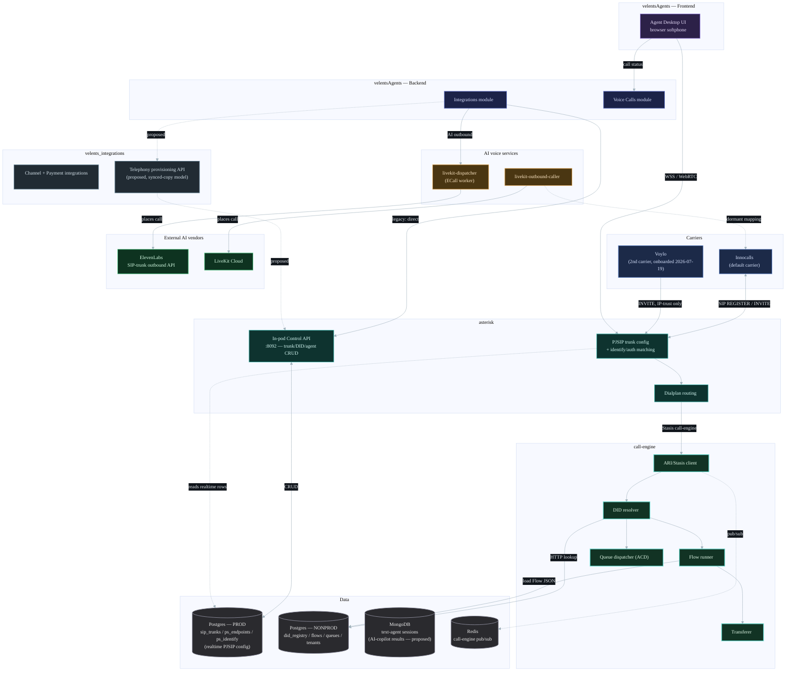

**Reading this**: the live path, proven 2026-07-19, is Carrier → Asterisk → `call-engine` →
Postgres NONPROD (DID/Flow lookup). The Control API / Postgres PROD path (trunk provisioning) is
also live, used to onboard both Innocalls and Voylo. Everything from `velents_integrations`'
proposed telephony API downward, and the MongoDB AI-copilot path, is proposed/not built —
**unchanged as of 2026-07-20**.

### 2.1 Data stores at a glance

Where each piece of preserved data actually lives — cross-referencing the per-service "Preserved
data in DB" subsections in Part 5 with the two adjacent stores (MongoDB, Redis) that don't belong
to any single one of the seven services detailed there.

| Engine | Instance / scope | Owned by | What lives there | Status |
|---|---|---|---|---|
| Postgres | PROD (realtime PJSIP config) | `asterisk` (5.1) | `sip_trunks`, `ps_endpoints`, `ps_auths`, `ps_aors`, `ps_identify` (+ legacy `sip_providers`/`sip_trunk_accounts`) | Live |
| Postgres | NONPROD (tenant data) | velentsAgents Backend (5.4), read by `call-engine` (5.2) | `did_registry`, `flows`, `queues`, `tenants` | Live |
| Postgres | instance unspecified | `call-engine` (5.2) | `call_events` — call-state/CDR logging | **Not persisting** — `DATABASE_URL` unset |
| Postgres | proposed shared telephony store | `velents_integrations` (5.5) | synced copy of DID registry, published Flows, trunk/endpoint config | Proposed, not built |
| Postgres/MySQL (engine not confirmed) | `velents_integrations`' own app database | `velents_integrations` (5.5) | WhatsApp/Messenger/Instagram + Payment (MoneyHash) integration data | Live, schema not documented here |
| MongoDB | `text-agent`'s own `mlapi` database | `text-agent` (adjacent service, not one of the 7 CC services) | session/conversation persistence, DSPy prompt/log collections | Live, but not CC-specific |
| MongoDB | proposed AI-copilot results store | not yet owned by any service | sentiment/intent/tool/reply-rec results + KB-match % (Part 3a's human-assist flow) | Proposed, not built |
| Redis | `call-engine` pub/sub | `call-engine` (5.2) | ephemeral call-event pub/sub messaging | Live, but **not a data store** — nothing is retained/queryable after the fact |

Recordings (MixMonitor output, asterisk 5.1) are the one preserved artifact that lives in **none**
of these — they're audio files on a Kubernetes PVC, referenced by filename/path only, not a
database row anywhere.

---

## 3. Inbound calls — API request sequence

Two flows, matching the two ways an inbound call can be handled once `call-engine` resolves its
DID. Grounded in real, confirmed `call-engine` internals (ARI Stasis subscription, HTTP DID
resolution, Flow-runner node types) — not just the originally-proposed design.

### 3a. Human-agent-assisted call

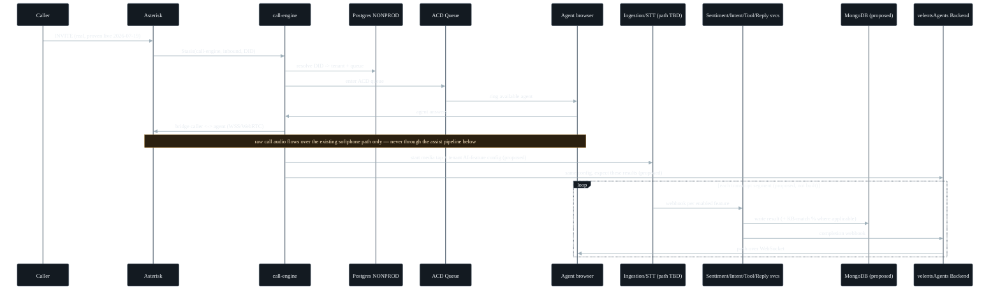

### 3b. AI-agent-handled call, with human takeover

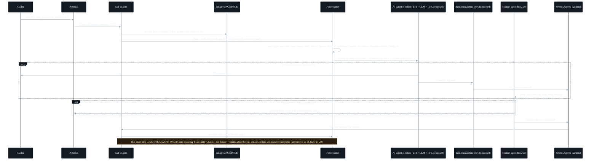

---

## 4. Outbound calls — API request sequence (AI-initiated)

The only outbound path that's real and working today is AI-initiated — a human agent clicking
"call" from their own softphone is a separate, unbuilt path (Inc 11).

```mermaid
%%{init: {'theme': 'base', 'themeVariables': {'fontSize': '13px', 'fontFamily': 'IBM Plex Sans, Segoe UI, sans-serif', 'actorBkg': '#131a21', 'actorBorder': '#4d5c6b', 'actorTextColor': '#eef2f5', 'signalColor': '#9fb0ba', 'signalTextColor': '#e7ecf1', 'noteBkgColor': '#2b2010', 'noteBorderColor': '#8a6224', 'noteTextColor': '#ffe9c7'}}}%%
sequenceDiagram
  participant Trigger as Campaign/trigger (velentsAgents Backend)
  participant LKD as livekit-dispatcher
  participant LKO as livekit-outbound-caller
  participant EL as ElevenLabs SIP-trunk API
  participant LKC as LiveKit Cloud
  participant Callee as Callee (PSTN)

  alt ElevenLabs path (most-used today)
    Trigger->>LKD: request outbound AI call
    LKD->>LKD: ECall worker picks up job
    LKD->>EL: POST /v1/convai/sip-trunk/outbound-call
    EL->>Callee: places the call directly
  else LiveKit path (dormant selection branch)
    Trigger->>LKO: request outbound AI call
    LKO->>LKO: trunk_from_phone_number()\ncurrently hardcoded to a different trunk;\ninnocalls-selection branch commented out
    LKO->>LKC: CreateSIPParticipantRequest
    LKC->>Callee: places the call directly
    Note over LKO,Callee: mapping to Asterisk's innocalls trunk exists in code but isn't the active path
  end
  Note over Trigger,Callee: neither path routes through Asterisk today — both go straight from the AI voice service to the carrier/vendor
```

---

## 5. Per-service detail

Only the internal engineering services get a full section — third-party carriers/vendors
(Innocalls, Voylo, ElevenLabs, LiveKit Cloud) and adjacent AI services (`text-agent`,
`voice-agent`) appear in the diagrams above but aren't ours to report progress on.

### 5.1 `asterisk`

**General description**: this is the actual phone system — the layer that answers an incoming
call, checks which carrier it came from, and decides where to send it next. In technical terms:
the SIP/media layer, handling PJSIP trunk configuration, call routing (dialplan), and an in-pod
Control API for trunk/DID/agent provisioning. Everything downstream (`call-engine`, the Frontend
softphone) depends on this layer recognizing a call correctly and handing it off cleanly.

**Main functions**: PJSIP realtime trunk/endpoint/identify management (via Control API →
Postgres PROD); dialplan routing (`from-trunk`, `from-trunk-out`, `from-wss-agents-out`,
`from-flows`); WebRTC/WSS transport for the Frontend softphone; TURN/coturn for NAT traversal;
recording (MixMonitor + PVC storage).

**Preserved data in DB** (see 2.1 for the full cross-service breakdown):

**Postgres** (the PROD/realtime instance, database `velentsagents`) — this is the layer that
stores each carrier trunk's connection details and how inbound calls get matched to them, nothing
about a call's content, just "who can call us and how do we recognize them." Schema is `public`
(Postgres/default — not explicitly documented as anything else).

| Table | DB name | Schema | What it stores | Status |
|---|---|---|---|---|
| `sip_trunks` | `velentsagents` | `public` | One row per configured carrier trunk — name, host/IP, protocol, encrypted credentials, assigned DID numbers, channel limit. The canonical record the Control API's CRUD operates on. | Live |
| `ps_endpoints` | `velentsagents` | `public` | PJSIP realtime endpoint definitions — one per trunk, or per WebRTC agent identity. | Live |
| `ps_auths` | `velentsagents` | `public` | SIP authentication credentials (username/password) linked to an endpoint. | Live |
| `ps_aors` | `velentsagents` | `public` | Address of Record — where to actually reach an endpoint (its contact URI). | Live |
| `ps_identify` | `velentsagents` | `public` | IP-based identification rules — which source IP maps to which endpoint (the exact table Bug 7 broke). | Live |
| `sip_providers`, `sip_trunk_accounts` | `velentsagents` | `public` | Pre-`sip_trunks` tables, superseded by the canonical `sip_trunks` table above. | Legacy — being retired |

**Filesystem (Kubernetes PVC)** — not a database: call recordings (MixMonitor output) are stored
here as audio files, referenced by filename/path only. There is no database row for the audio
content itself.

**Call-center-specific logic**: none of the CC product logic lives here — this layer only
recognizes a call and hands it to `call-engine` via `Stasis(call-engine, inbound, ${EXTEN})`. Its
job is purely "is this a call I should accept, and where does it go."

**Inner logic flowchart**:

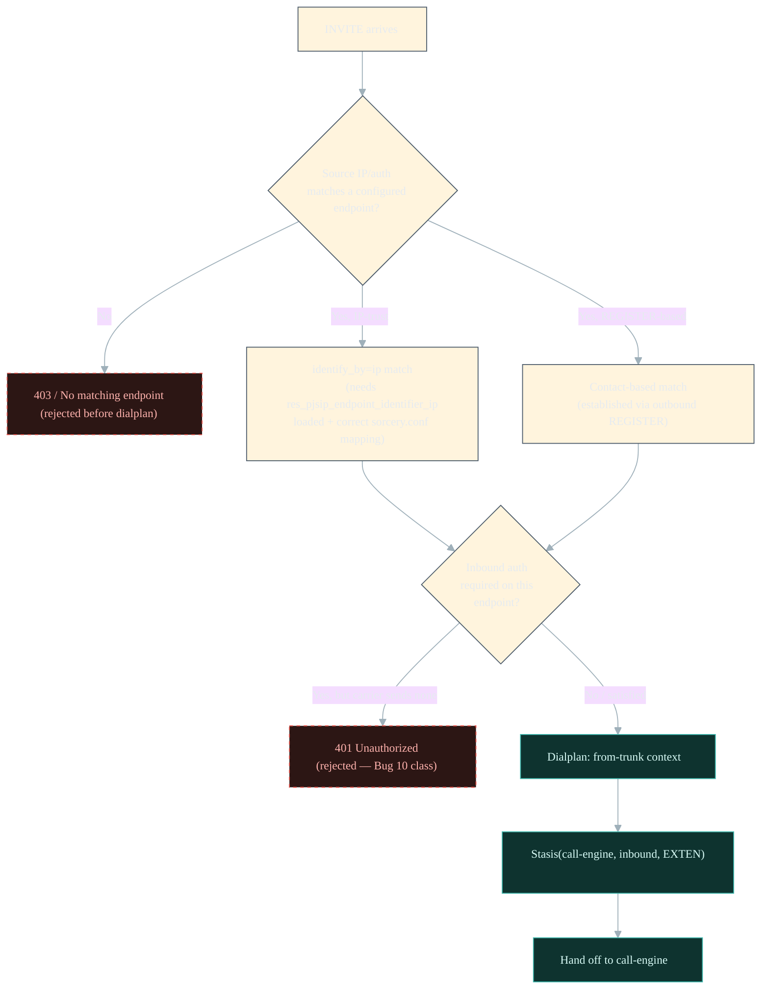

**Progress / status**: **~70%** for the pieces this doc covers. Trunk CRUD, identify-based
IP-trust matching, and dialplan routing to `call-engine` are all confirmed working live, on two
independent carriers. Recording storage plumbing exists. WebRTC softphone transport is built.
Not done: AI Audio Bridge (still a 3-second-tone stub), `externalMedia` wiring for
supervisor barge/whisper (primitive exists, not wired to any UI).

---

### 5.2 `call-engine`

**General description**: the decision-maker for every call — once a call arrives, this service
figures out which customer it belongs to and what should happen next (play a menu, hand it to an
AI agent, route it to a human queue, or transfer it elsewhere). In technical terms: the always-on
ARI/Stasis client every call is handed to, responsible for DID/tenant resolution, Flow execution
or ACD queue dispatch, and transfer/bridge execution. Deployed from the `agent-hub` GitHub repo,
but running as its own pod, architecturally disconnected from that repo's own frontend code.

**Main functions**: ARI WebSocket client (Stasis app `call-engine`); DID→tenant/Flow-or-queue
resolution (HTTP); Flow node-graph execution (`start`, `play`, `dtmf_collect`, `queue_enter`,
`hangup`, `set_var`, `if`, `webhook`, `transfer`, `voicemail`, `business_hours`, `bridge_ai`);
queue/ACD dispatch (parallel path to Flows); transfer/bridge execution to agent/extension/e164
targets; call-state lifecycle logging (not currently persisted); agent-facing mid-call control
API (`/control/calls/:id/transfer`, likely hold/hangup); AudioSocket stub for the `bridge_ai` node.
As of 2026-07-21, also ships centralized Velents Elasticsearch logging (`services_logs`/
`cost_logs`, tagged `AgentHub`/`Call Engine`) — every store error, external Laravel call, and
control-API/gateway request is now visible on the shared monitoring dashboard, not just local
process logs.

**Preserved data in DB** (see 2.1 for the full cross-service breakdown):

**Postgres** (intended — instance unspecified since `DATABASE_URL` is unset) — intended to log
what happened on every call; that logging is currently switched off in this deployment.

| Table | DB name | Schema | What it stores | Status |
|---|---|---|---|---|
| `call_events` | *(unspecified — `DATABASE_URL` unset)* | *(unspecified)* | Meant to hold the call-state lifecycle (`INCOMING` → ... → ended) for every call this service handles — i.e. this would be the platform's CDR source. | **Not created — `DATABASE_URL` unset, so nothing is ever written; state changes are only logged, not persisted** |

**Redis** (pub/sub only — not a persisted store): used purely as a real-time message bus. When a
call event happens (e.g. a state change), it's published to a channel so anything else listening
can react immediately — this is the same Redis referenced as `call-engine`'s pub/sub in the master
architecture diagram (Part 2). Nothing is retained: if no subscriber happens to be listening at
that exact moment, the message is gone for good, and there's no way to look up "what happened on
this call" afterward the way a database table would allow. Functionally this is a live signal, not
a data store.

It also *reads* (doesn't own) `did_registry` and `flows` from the tenant-data Postgres instance —
see 5.4.

**Call-center-specific logic**: this service *is* the Call Center feature's runtime brain — every
other service either feeds it data (DID registry, Flow definitions) or is fed by it (transfer
targets, call-state events).

**Inner logic flowchart**:

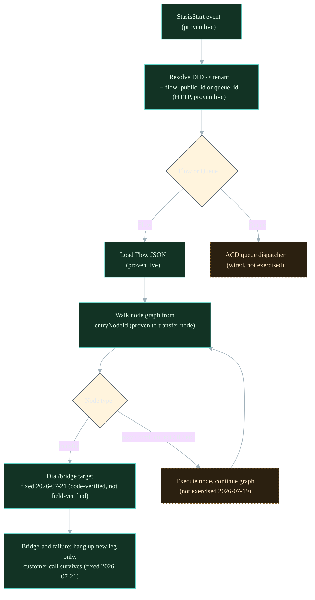

**Progress / status**: **~60%** as of 2026-07-21. ARI connection, Stasis subscription, DID
resolution, and Flow loading/walking confirmed live. The transfer/conference bug is fixed as of
2026-07-21 (code-verified via a mocked-ARI unit test, not yet re-verified against a live carrier
call) — no no-answer/timeout watchdog exists yet for either path, a known follow-up. `/healthz`
now checks real ARI reachability instead of just process bind. Call-state persistence still
disabled in this deployment. True source location within `agent-hub` still not fully resolved — a
standalone `call-engine` repo now exists with all of the above and is being treated as
authoritative going forward (see Part 9).

---

### 5.3 `velentsAgents` — Frontend

**General description**: the screen a human agent actually works from — their in-browser
softphone for answering, holding, transferring, and ending calls. In technical terms: the
browser-based Agent Desktop UI. For the Call Center feature specifically, this is where a human
agent's softphone lives — not a CC-specific build, but the existing WebRTC/WSS softphone
infrastructure this feature reuses.

**Main functions**: PJSIP-over-WSS softphone connection to Asterisk; call controls (answer,
decline, mute, hold, end, DTMF) per the INFATH demo's Agent Desktop module; screen-pop/transfer UI
(demo-only today).

**Preserved data in DB**: none — this is a browser UI with no database of its own. Anything it
needs to remember (call history, agent notes) is fetched from and saved through the Backend (5.4).
**Storage engine: N/A.**

**Call-center-specific logic**: none built specifically for CC yet — the softphone transport is
generic infrastructure. Workspace shell, live call-context display, wrap-up flow, and notes
capture (all part of Inc 2) are still frontend work, not started.

**Inner logic flowchart**:

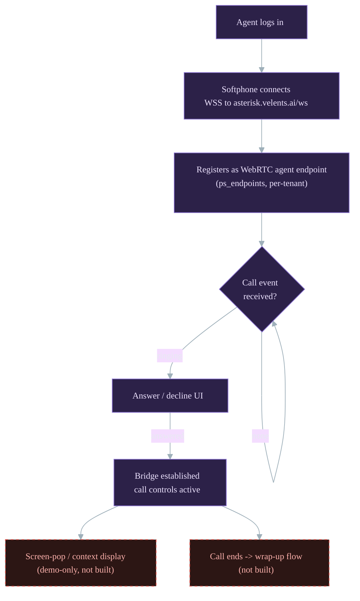

**Progress / status**: **Partial — softphone transport only**. The generic WebRTC/WSS connection
and basic call handling work (this is what carried the 2026-07-19 test calls). CC-specific desktop
UI (workspace shell, live context, wrap-up, notes) is 0% — demo mockup only. **Unchanged as of
2026-07-20**.

---

### 5.4 `velentsAgents` — Backend

**General description**: the record-keeper and provisioner — it stores which phone number
belongs to which customer, which call-handling script to run for them, and is the one that talks
to the phone system to set up new numbers and agents. In technical terms: the Laravel backend
module that owns tenant/business data and talks to both Asterisk's Control API and the AI voice
services. Also owns the central DID registry and per-tenant Flow storage that `call-engine` reads
from.

**Main functions**: Integration module (Control API trunk/agent CRUD, AI Call Dispatcher calls for
outbound); Voice Calls module (LiveKit voice, per-tenant); `did_registry` and `flows` tables
(central + per-tenant Postgres, on the NONPROD instance); Conversations/Calls/Inbox modules
(different product surface, reusable patterns).

**Preserved data in DB** (see 2.1 for the full cross-service breakdown):

**Postgres** (the NONPROD/tenant-data instance, database `velentsagents`) — the source of truth
for "which number belongs to which customer, and what should happen when it rings." Lives on a
separate instance from Asterisk's own realtime-config database (same database name, different RDS
instance — see 2.1), and is exactly what `call-engine` reads from on every call. Schema is
`public` (Laravel/Postgres default — not explicitly documented as anything else).

| Table | DB name | Schema | What it stores | Status |
|---|---|---|---|---|
| `did_registry` | `velentsagents` | `public` | Maps each DID (phone number) to the tenant that owns it, and to the Flow or queue that should handle it. | Live |
| `flows` | `velentsagents` | `public` | Each tenant's Flow — the IVR node-graph definition `call-engine` loads and executes. | Live |
| `queues` | `velentsagents` | `public` | Queue definitions for human-agent ACD routing. | Live |
| `tenants` | `velentsagents` | `public` | Tenant/business records this platform serves. | Live |

**Call-center-specific logic**: today, this is the direct owner of the DID→tenant→Flow mapping
`call-engine` depends on for every inbound call, and the direct caller of Asterisk's Control API
for trunk provisioning (used to onboard both Innocalls and, on 2026-07-19, Voylo).

**Inner logic flowchart**:

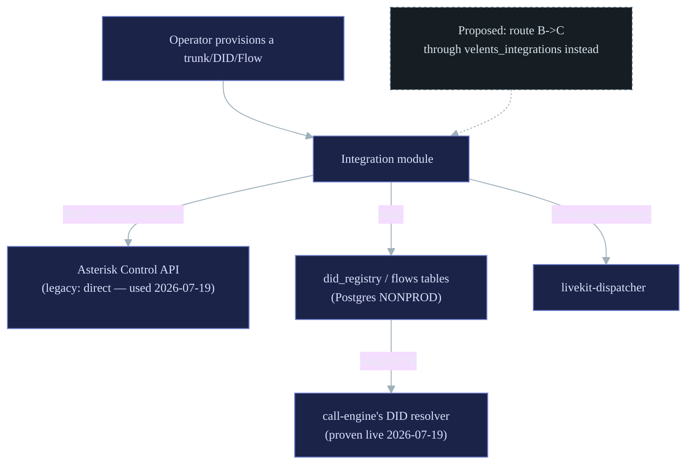

**Progress / status**: **Live and working** for what exists — DID registry + Flow storage +
Control API calls all confirmed functioning on 2026-07-19. Not yet done: routing this through
`velents_integrations` instead of calling the Control API directly (decided 2026-07-19, still not
built as of 2026-07-20); CC-specific product features (ACD, WFM, dashboards) are separate, unbuilt
modules — unchanged.

---

### 5.5 `velents_integrations`

**General description**: a shared connector hub — the idea is that any product, not just one
customer-facing app, talks to WhatsApp, payments, or (proposed) the phone system through this one
service, instead of each product building and maintaining its own connection. In technical terms:
a standalone Laravel service intended as the single API surface other services call through,
instead of each one re-integrating with a target system individually. Today it owns
WhatsApp/Messenger/Instagram channel adapters and Payment (MoneyHash) integration;
on 2026-07-19 it was decided it should also own the telephony provisioning/lookup API — still not
built as of 2026-07-20.

**Main functions today**: WhatsApp onboarding/templates/messaging, Messenger auth/chat, Payment
account/subscription/transaction management. No telephony code exists here yet — unchanged.

**Preserved data in DB** (see 2.1 for the full cross-service breakdown):

**Postgres or MySQL** (not confirmed in this doc — `velents_integrations`' own app database) —
today's integration credentials/config for the channels it already brokers.

| Table / scope | DB name | Schema | What it stores | Status |
|---|---|---|---|---|
| Channel integrations | *(not documented)* | *(not documented)* | WhatsApp/Messenger/Instagram onboarding state, templates, auth tokens — exact schema not documented in this doc. | Live |
| Payment integration | *(not documented)* | *(not documented)* | MoneyHash account/subscription/transaction records — exact schema not documented in this doc. | Live |

**Postgres** (proposed shared telephony store) — a synced copy of telephony data so any tenant
backend can reach it through one API instead of talking to Asterisk directly.

| Table / scope | DB name | Schema | What it stores | Status |
|---|---|---|---|---|
| Telephony config | *(TBD — not decided)* | *(TBD — not decided)* | A synced copy of `did_registry`, published Flows, and trunk/endpoint config — written on publish, read by `call-engine` instead of the tenant DB directly. | Proposed, not built |

**Call-center-specific logic (proposed, decided 2026-07-19, still not built as of 2026-07-20)**: own the shared,
backend-agnostic telephony config store — DID registry, published Flows, trunk/endpoint config —
so any tenant backend (not just `velentsAgents`) can push/read through one API instead of talking
to Asterisk's Control API directly. Synced-copy model: push on publish, `call-engine` reads
through this API, never the shared DB directly.

**Inner logic flowchart** (proposed target state):

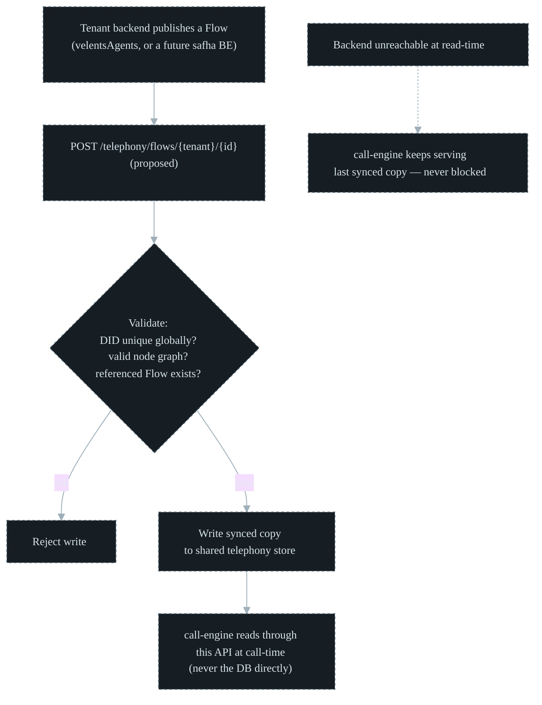

**Progress / status**: **0% for telephony** — this entire section is a decided design, not a line
of code yet. Channel/payment integrations (its existing scope) are live and unrelated to CC.

---

### 5.6 `livekit-dispatcher`

**General description**: the service that places outbound AI phone calls today — when an AI agent
needs to call a customer, this is what actually dials out. In technical terms: a FastAPI
dispatcher that places AI-initiated outbound calls via ElevenLabs' own SIP-trunk API — the
most-used AI-outbound path today.

**Main functions**: `ECall` worker — receives a dispatch request, calls ElevenLabs'
`POST /v1/convai/sip-trunk/outbound-call`, monitors the resulting call.

**Preserved data in DB**: none confirmed — this service's own persistence hasn't been directly
inspected. Call/job state is most likely tracked in-memory for the life of the dispatch request,
with the actual call record living in ElevenLabs' own systems. **Storage engine: N/A / not
confirmed.**

**Call-center-specific logic**: this is a fully separate, already-working AI-outbound pipeline
against the same `innocalls` carrier Asterisk's PJSIP trunks use — parallel to Asterisk, not
integrated with it.

**Inner logic flowchart**:

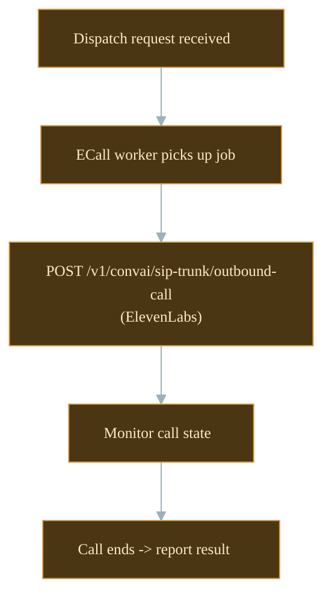

**Progress / status**: **Live and working**, unrelated to Asterisk. No bridge exists connecting
this to Asterisk's AudioSocket tap or PJSIP trunk (Inc 1's AI Audio Bridge gap).

---

### 5.7 `livekit-outbound-caller`

**General description**: a second, alternate way to place outbound AI calls — built and working,
but not the path currently in active use. In technical terms: a LiveKit agent worker that places
outbound calls via LiveKit Cloud. Has a dormant mapping to Asterisk's `innocalls` carrier that
isn't on the active code path.

**Main functions**: `phone_dict` mapping (includes `"innocalls"` → a LiveKit outbound-trunk ID);
`trunk_from_phone_number()` — currently hardcoded to a different trunk, with the innocalls branch
commented out; `CreateSIPParticipantRequest` to LiveKit Cloud.

**Preserved data in DB**: none confirmed — same caveat as `livekit-dispatcher`. The `phone_dict`
trunk-selection mapping lives in source code, not a database, and call state is handled by
LiveKit Cloud. **Storage engine: N/A / not confirmed.**

**Call-center-specific logic**: same category as `livekit-dispatcher` — a working AI-outbound
pipeline, parallel to Asterisk, with a not-yet-activated hook toward Asterisk's carrier.

**Inner logic flowchart**:

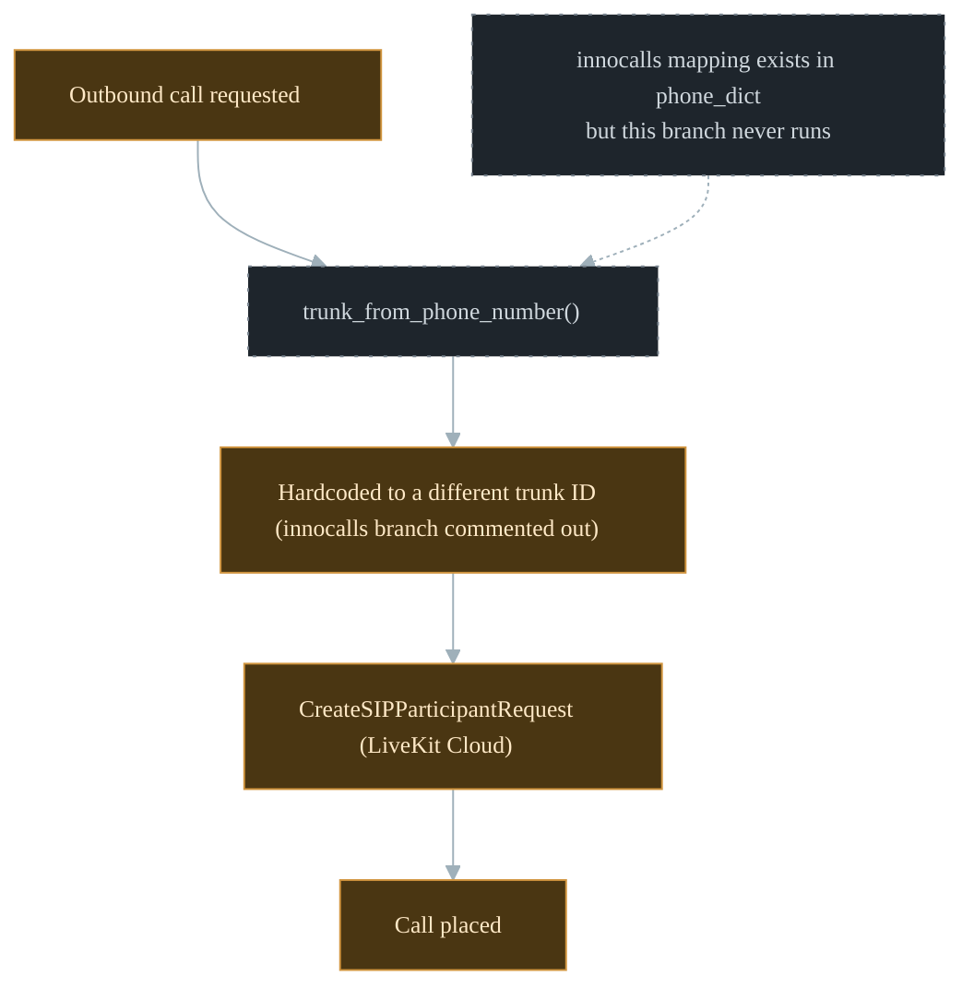

**Progress / status**: **Live and working** for the active (non-innocalls) path. The innocalls
mapping is present-but-dormant — activating it is part of Inc 1's AI Audio Bridge estimate.

---

## 6. Tasks — increment-level tracking

One row per increment (matches the dossier's board order and the feature-gap plan's table
exactly). "Services" uses the color code from the top of this doc. **Note (2026-07-20)**: the
"Blocked by" column below was cross-checked against the real dependency data in
`ref/agent-hub-cxm-contact-center-full-context-dossier.md` — Inc 2's and Inc 4's cells were
previously missing a real edge; both now list Inc 3, and Inc 4 now also lists Inc 1. See Part 6.1
for the full dependency graph this correction feeds into.

| # | Increment | Services | Progress | Status | Blocked by | Est. time | Needs modification? |
|---|---|---|---|---|---|---|---|
| Inc 1 | Voice Engine Spine (P0, *In Progress*) | 🟢 asterisk<br>🟩 call-engine<br>🟧 AI voice services | **~70%** | In progress | Nothing blocking the spine itself; AI Audio Bridge needs a cross-repo change in `livekit-outbound-caller` too | Session/event model 4-6wk; AI bridge 2-4wk; screen-pop 2-3wk; DR 2wk+ | **Yes** — activate the dormant innocalls branch in `livekit-outbound-caller`; build persistence for `call-engine`'s call-state logging (currently no-ops). *(As of 2026-07-20: the ElevenLabs path via `livekit-dispatcher` is what's actually live for AI-outbound today; the LiveKit/innocalls branch is still dormant, unchanged since 2026-07-19.)* |
| Inc 2 | Unified Agent Desktop (P2) | 🟣 velentsAgents — Frontend<br>🟢 asterisk | 0% (backend only) | Not started | Blocked by Inc 1, Inc 3 | 6-10wk | No — needs building, not modifying existing code |
| Inc 3 | Routing & ACD parity (P1) | 🔷 velentsAgents Backend (candidate) | 0% | Not started | Blocks Inc 2 and Inc 4 | 8-12wk | No — net new |
| Inc 4 | Supervisor live ops (P2) | 🟢 asterisk (`externalMedia`)<br>🟣 velentsAgents — Frontend | ~10% (primitive only) | Not started | Blocked by Inc 1, Inc 3 | Barge/whisper 6-10wk; full suite 3mo+ | **Yes** — wire the existing ARI `externalMedia` primitive to a UI, not build it from scratch |
| Inc 5 | Recording Management (P1) | 🟢 asterisk (MixMonitor/PVC) | ~30% (storage only) | Externally blocked | AGH-6685 — needs NCA/PDPL reference from INFATH (due 2026-07-19, **now past due as of 2026-07-20**) | Retention 3-4wk; console 2-3wk once unblocked | No, once unblocked |
| Inc 6 | Omnichannel completion (P3) | 🔷 velentsAgents — Backend<br>⬜ velents_integrations | ~40% (channels exist, CC-wiring doesn't) | Not started | — | 4-6wk (+1-2wk for the API-surface simplification) | **Yes** — same simplification decided 2026-07-19 for the telephony domain (see Part 5.5) applies here too. *(Unchanged as of 2026-07-20 — still a decision, not code.)* |
| Inc 7 | Agent/Workforce mgmt (P1) | 🔷 velentsAgents Backend (Management module, partial) | ~10% (roles/staff only, not WFM) | Not started | Blocks Inc 8 | 6-8wk | No — net new WFM engine |
| Inc 8 | CC dashboards & reports (P1) | 🔷 velentsAgents Backend (Analytics/Observer, adjacent) | 0% (CC-specific) | Not started | Blocked by Inc 7 and Inc 1 | 5-7wk | No — net new, though KPI targets are already specified |
| Inc 9 | IVR & self-service (P3, P1-linked) | 🟢 asterisk<br>🟩 call-engine | **~50%** *(corrected up 2026-07-19 — the dossier had marked it "doesn't exist"; it is now proven ~50% working, unchanged as of 2026-07-20)* | In progress (undocumented) | Visual builder UI blocked on nothing technical, just unstarted | 4-6wk builder (transfer-node fix done) | **Yes** — transfer-node bug fixed 2026-07-21 (code-verified, not field-verified — see Bug 11); builder UI still net new/unstarted |
| Inc 10 | Agent Assist & Productivity (P3) | 🔷 velentsAgents Backend (general AI infra, adjacent) | 0% (CC-specific) | Not started | — | 8-12wk | No — net new |
| Inc 11 | Outbound & Callback (P3) | 🟧 AI voice services (human-outbound is the gap) | ~60% (AI-initiated only) | Partial | Blocked behind Inc 9's callback dependency | 4-6wk for the human-agent path | No — human-outbound is additive, not a modification of the AI path. *(Unchanged as of 2026-07-20 — the human-agent path hasn't been started since this estimate was written.)* |
| Inc 12 | Governance, RBAC & Audit (P1) | 🔷 velentsAgents Backend (Spatie roles, AuditLog) | ~20% (foundations only) | Not started | — | 3-5wk | No — reusable foundations, net new CC wiring |
| Inc 13 | Productization / 2nd-client readiness (P5) | 🔷 velentsAgents — Backend<br>⬜ velents_integrations | ~15% *(the 2026-07-19 data-ownership decision is direct groundwork; unchanged as of 2026-07-20)* | Not started | Blocked by Inc 2 | 6-10wk, mostly after everything else ships | No — the 2026-07-19 decision (Part 5.5 / companion Worker2 doc) already resolved the hardest open design question; still just a design as of 2026-07-20 |

### 6.1 Dependency graph

Built from the real Linear dependency data in
`ref/agent-hub-cxm-contact-center-full-context-dossier.md` (not re-derived from this doc's own
prose), which is how the Inc 2/Inc 4 gaps above were caught. Nodes are colored by phase (P0-P5);
solid edges are hard increment-to-increment blockers, the single dashed edge is the one external
(non-increment) compliance blocker.

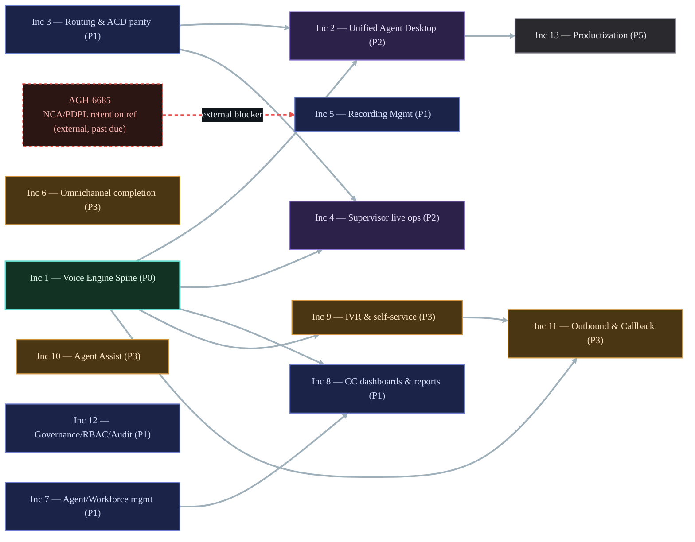

**Inc # ↔ Phase ↔ dependency-order crosswalk**:

| Inc # | Phase | Depends on | Unblocks |
|---|---|---|---|
| Inc 1 | P0 | — (root) | Inc 2, Inc 4, Inc 8, Inc 9, Inc 11 |
| Inc 3 | P1 | — (root) | Inc 2, Inc 4 |
| Inc 7 | P1 | — (root) | Inc 8 |
| Inc 5 | P1 | AGH-6685 (external) | — |
| Inc 9 | P3 | Inc 1 | Inc 11 |
| Inc 2 | P2 | Inc 1, Inc 3 | Inc 13 |
| Inc 4 | P2 | Inc 1, Inc 3 | — |
| Inc 8 | P1 | Inc 1, Inc 7 | — |
| Inc 11 | P3 | Inc 1, Inc 9 | — |
| Inc 13 | P5 | Inc 2 | — |
| Inc 6, Inc 10, Inc 12 | P3 / P1 | — (no tracked edges) | — |

### 6.2 Inc 1 — Linear issue breakdown

The parent issue (AGH-6655) plus its 6 children, from the dossier. Two status columns on purpose:
what Linear says vs. what's actually true in this repo — they only disagree once, on AGH-6664.
Est. time is a baseline human-pace guess; expect it to shrink on the well-scoped items since
these will be built with Claude Code's help.

| # | Issue | Services | Linear status | Actual status | Priority | Est. time | Notes |
|---|---|---|---|---|---|---|---|
| AGH-6655 | **Inc 1 (parent) — Voice Engine Spine** | 🟢 asterisk<br>🟩 call-engine<br>🟧 AI voice services | In Progress | ~70% | High | 13-20wk sequential; less in parallel | Only item in progress out of 100 issues in the whole project. |
| AGH-6664 | P0.1 — SIP trunk / telephony edge connectivity | 🟢 asterisk | Backlog | Live | High | Done — already live | Proven live on two carriers (Part 5.1) — Linear hasn't caught up. |
| AGH-6670 | P0.2 — Canonical call session and event model | 🟩 call-engine | Backlog | Not started | High | 4-6wk | The disabled `call_events` gap (Part 8). |
| AGH-6681 | P0.3 — In-region media / capture path | 🟢 asterisk<br>🟩 call-engine | Backlog | Stub only | High | 2-4wk | AI Audio Bridge is still a 3-second-tone stub (Part 5.1/5.2). |
| AGH-6688 | P0.4 — Click-to-call / call initiation spine | 🟣 velentsAgents — Frontend<br>🔷 velentsAgents — Backend | Backlog | Not started | High | 3-5wk | Human click-to-call — not built. See Inc 11. |
| AGH-6695 | P0.5 — Screen-pop / customer context handoff spine | 🟣 velentsAgents — Frontend<br>🟩 call-engine | Backlog | Not started | High | 2-3wk | Demo mockup only (Part 5.3) — no real handoff yet. |
| AGH-7262 | P0.6 — DR posture / resilience for voice spine | 🟢 asterisk | Backlog | Not started | High | 2wk+ | No DR/resilience posture found anywhere in this repo. |

---

## 7. Bugs (found 2026-07-19 unless noted, status as of 2026-07-21)

Twelve bugs, eight fixed, two worked around, two need an owner.

| # | Bug | Risk | Status |
|---|---|---|---|
| 1 | `.env` `ASTERISK_WSS_URL` pointed at dead port `:8089` | High | Fixed |
| 2 | Gate A/B WSS-host detection matched a nonexistent subdomain | Medium | Fixed |
| 3 | Gate A's RTP-range check never matched the real NodePort listing | Medium | Fixed |
| 4 | Gate D's transport-loaded grep anchor had an extra leading space | Medium | Fixed |
| 5 | `/healthz` only checked process bind, not real ARI reachability | High | Fixed + deployed. Ported forward into the standalone `call-engine` repo 2026-07-21 (was missing there until now). |
| 6 | `ARI_URL=http://120.0.0.1:8088` looks like a `127.0.0.1` typo | Low/Unknown | Needs an owner to confirm intent |
| 7 | `identify` sorcery type mapped under the wrong module section — broke IP-based trunk recognition **platform-wide** | High | Fixed + verified live |
| 8 | Bug 5's fix was also used by `entrypoint.sh`'s boot gate, which deadlocked once `/healthz` reflected real ARI state — crash-looped production | **Critical** — self-inflicted incident | Fixed + deployed |
| 9 | `aws-load-balancer-controller` crash-looping ~5 days; NLB target groups never resync on pod IP change | High, cluster-wide | Worked around, not fixed |
| 10 | Trunk creation forces inbound auth onto every trunk, including IP-trust-only carriers that never send credentials | Medium | Worked around live, not fixed in code |
| 11 | Transfer/conference `appArgs` contract mismatch in `call-engine` — `transferer.js`/`control-api.js` originated the new leg with the literal string `"transfer"`/`"conference"` where `ari.js`'s `dialed` `StasisStart` handler expected a real channel ID, so the lookup always missed and the new leg was hung up on arrival; separately the old agent leg was retired unconditionally right after `originate()` resolved, before the replacement was ever confirmed bridged — this is the "ARI Channel not found ~600ms in" bug from Part 1 | High | Fixed 2026-07-21 — two new `StasisStart` branches keyed by the call's `uuid`, old-leg hangup deferred until the new leg is confirmed bridged. Code-verified via a mocked-ARI unit test, not yet re-verified against a live carrier call. |
| 12 | *(found 2026-07-21, not the original test pass)* `gateway.js`'s Redis subscriber called `psubscribe('*')` immediately after construction, before the connection could possibly be ready — always failed, 100% reproducible, whenever `GATEWAY_ENABLED` and `LARAVEL_API_URL` were both set | High | Fixed 2026-07-21 — waits for the client's `ready` event before subscribing. |

---

## 8. Risks

*(Status below reflects 2026-07-21 — most items were identified 2026-07-19 and hadn't been
revisited since 2026-07-20; two items were updated 2026-07-21 following code fixes in
`call-engine`, noted explicitly below.)*

- **`aws-load-balancer-controller` instability (Bug 9) is a live, recurring risk** — any pod
  restart, for any service on this cluster, can silently drop traffic until manually corrected.
  Not specific to Call Center, but this feature depends on Asterisk's own pod staying correctly
  registered. **Still open as of 2026-07-20** — worked around, not fixed.
- **`call-engine`'s call-state persistence is disabled** (`DATABASE_URL not set; call_events writes
  will no-op`) — meaning **no CDR/call-history data is currently being captured** for any live
  call through this pipeline, CC or otherwise. This is a silent gap, not a loud failure. **Still
  open as of 2026-07-20.**
- **`sip_store.py`'s auth-forcing gap (Bug 10) will recur** for the next IP-trust-only carrier
  onboarded, until fixed in code rather than worked around per-trunk in the DB. **Still open as of
  2026-07-20** — no code fix has landed.
- **`call-engine`'s true source location within `agent-hub` is still not fully resolved** — the
  deployed build comes from a branch, not `main`, and that repo's own history suggests an
  incomplete split between frontend and backend. This is a maintainability/ownership risk: it's
  unclear who is expected to maintain this service or where new work on it should land. **Still
  open as of 2026-07-20** — see Part 9's TBD for the 2026-07-21 update (a standalone repo now
  exists, but reconciling it with `agent-hub`'s actual deployment is unresolved).
- **Single point of failure in the Flow-runner's transfer step — resolved 2026-07-21.** The
  underlying `appArgs` contract bug (Bug 11) is fixed and unit-tested. **Still open**: the other
  node types (`dtmf_collect`, `if`, `webhook`, `voicemail`, `business_hours`) were confirmed not to
  originate channels, so aren't exposed to this exact race — but `queue_enter`'s dispatch path
  (delegated to `QueueDispatcher`) was **not** audited for similar issues. Worth doing before
  building further on top of it.
- **Compliance dependency (Inc 5, AGH-6685)** — recording retention/redaction policy is externally
  blocked on an NCA/PDPL reference from INFATH, with a due date of 2026-07-19 that is **now past
  due as of 2026-07-20**.
- **Multi-tenant data-ownership complexity increases as a second client (e.g. `safha`) comes
  online** — the 2026-07-19 synced-copy design addresses the architecture, but it's still a design,
  not running code as of 2026-07-20; the actual migration of `velentsAgents`' direct Control-API
  calls to go through `velents_integrations` hasn't started.

---

## 9. TBD (open decisions, not yet resolved)

- **STT ingestion path** for the human-assist pipeline — direct `AudioSocket`/`externalMedia` tap
  vs. bridging into a LiveKit room as a silent subscriber. Explicitly deferred, not decided.
- **Which service performs `tool_recommendation`'s KB lookup** — no service exists to check yet
  (resolved for `reply_recommendation`, via `voice-agent`; still open for `tool_recommendation`).
- **Whether the AI-copilot results store shares `text-agent`'s existing MongoDB instance** or gets
  a dedicated one.
- **Where exactly `call-engine`'s source lives within the `agent-hub` repo** — which repo deploys
  it is answered; the precise branch/path is not. **2026-07-21**: a standalone `call-engine` repo
  now exists (renamed from `agenthub-call-engine`) carrying the transfer/conference fix, the
  ported-forward Bug 5 `/healthz` fix, the Bug 12 gateway fix, and full Velents ES logging — it's
  being treated as authoritative going forward, but reconciling it with whatever `agent-hub`
  actually deploys is still unresolved.
- **Whether/when to activate `livekit-outbound-caller`'s dormant innocalls branch**, and whether
  that's the chosen path for Inc 1's AI Audio Bridge at all (vs. the ElevenLabs path).
- **Whether the Flow-runner's *remaining* node types have similar timing bugs** to the transfer
  node — the transfer node's own bug is fixed as of 2026-07-21 (Bug 11), and `dtmf_collect`/`if`/
  `webhook`/`voicemail`/`business_hours` were confirmed not to originate channels (so aren't
  exposed to this exact race class), but `queue_enter`'s `QueueDispatcher`-delegated dispatch path
  was not audited. Still open.
- **Bug 6** (`ARI_URL` typo) — still needs a human to confirm intent. **Unchanged as of
  2026-07-20.**

---

## 10. Abbreviations

| Term | Meaning |
|---|---|
| **ACD** | Automatic Call Distributor — routes a queued call to an available agent |
| **AGH** | Linear issue-key prefix used for every ticket tracked in the contact-center dossier |
| **API** | Application Programming Interface |
| **ARI** | Asterisk REST Interface — the WebSocket/REST protocol `call-engine` uses to control live calls |
| **CC** | Call Center — this feature |
| **CDR** | Call Detail Record — a logged record of a completed call (time, duration, parties, outcome) |
| **CRUD** | Create / Read / Update / Delete |
| **CXM** | Customer Experience Management — the umbrella product/Linear project this feature lives under |
| **DID** | Direct Inward Dialing — a phone number that routes inbound calls to a specific tenant/flow |
| **DTMF** | Dual-Tone Multi-Frequency — the tones sent when a caller presses a phone keypad digit |
| **E.164** | The international standard format for phone numbers (e.g. `+9661XXXXXXXX`) |
| **IVR** | Interactive Voice Response — an automated menu/flow a caller navigates before reaching an agent |
| **KB** | Knowledge Base |
| **KPI** | Key Performance Indicator |
| **LLM** | Large Language Model |
| **NAT** | Network Address Translation |
| **NCA** | (Saudi) National Cybersecurity Authority |
| **NLB** | Network Load Balancer |
| **PDPL** | (Saudi) Personal Data Protection Law |
| **PJSIP** | The SIP stack module Asterisk uses for trunk/endpoint/identify configuration |
| **PSTN** | Public Switched Telephone Network — the regular phone network calls ultimately traverse |
| **PVC** | Persistent Volume Claim — Kubernetes storage backing MixMonitor recordings |
| **RBAC** | Role-Based Access Control |
| **SIP** | Session Initiation Protocol — the signaling protocol used to set up/tear down calls |
| **SLA** | Service-Level Agreement — a target response/handling time |
| **STT** | Speech-to-Text |
| **TTS** | Text-to-Speech |
| **TURN** | Traversal Using Relays around NAT — relay service that lets WebRTC media traverse NAT/firewalls |
| **WebRTC** | Web Real-Time Communication — the browser protocol behind the Agent Desktop softphone |
| **WFM** | Workforce Management — agent scheduling/staffing |
| **WSS** | WebSocket Secure — the encrypted WebSocket transport the browser softphone uses |
